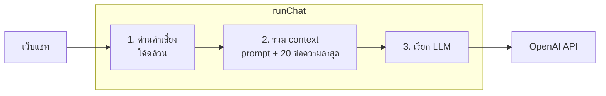

# น้องฟัง (Nong Fang)

แชทบอทเพื่อนคุยภาษาไทย สำหรับระบายความในใจ และหาไฟในการทำงานหรือพัฒนาตัวเอง

*A Thai-language companion chatbot for venting and motivation, built with Next.js and the Vercel AI SDK. Phase 1 of a roadmap from chatbot to AI agent.*

<!-- TODO: ใส่ GIF หรือวิดีโอสาธิตตรงนี้ (อัดหน้าจอมือถือ 15–30 วินาที) -->

> **น้องฟังเป็น AI ไม่ใช่การบำบัดหรือคำแนะนำทางการแพทย์**
> ถ้ากำลังรู้สึกหนักมากหรือคิดอยากทำร้ายตัวเอง โทรสายด่วนสุขภาพจิต **1323** ได้ฟรีตลอด 24 ชั่วโมง หรือ **1669** ในกรณีฉุกเฉิน

## ปัญหาและแนวคิด

บางวันเราแค่อยากมีใครสักคนฟัง โดยไม่ถูกตัดสินหรือรีบสั่งสอน บางวันก็อยากได้แรงผลักให้เริ่มงานที่ค้างอยู่ น้องฟังออกแบบมาให้ทำได้ทั้งสองแบบ:

- **โหมดรับฟัง** สะท้อนความรู้สึกก่อน ไม่เสนอทางแก้ถ้าไม่ได้ขอ
- **โหมดหาไฟ** แตกเป้าหมายใหญ่เป็นก้าวเล็กที่ทำได้วันนี้ และพูดตรงๆ เมื่อแผนหักโหมเกินไป

## สถาปัตยกรรม



รายละเอียดเพิ่มเติมใน [`docs/ARCHITECTURE.md`](docs/ARCHITECTURE.md)

## การตัดสินใจด้านการออกแบบ

- **ด่านคำเสี่ยงเป็นโค้ด ไม่ฝากไว้กับ LLM:** LLM อาจตอบพลาดได้เสมอ การ์ดสายด่วนจึงมาจากโค้ดที่ทำงานเหมือนเดิมทุกครั้งและมี unit test ครอบคลุม แม้ LLM ตอบไม่สำเร็จ หน้าเว็บก็ยังแสดงเบอร์สายด่วน
- **ส่งประวัติให้ LLM แค่ 20 ข้อความล่าสุด:** ค่าใช้จ่ายต่อข้อความจึงคงที่ ไม่โตตามความยาวแชท
- **ไม่เก็บเนื้อหาแชทใน log:** เรื่องที่คนระบายเป็นข้อมูลอ่อนไหว log จึงเก็บแค่จำนวน token และสถานะ
- **ใส่รหัสผ่านตั้งแต่เฟสแรก:** URL บน Vercel เปิดสาธารณะ ใครเจอก็ใช้เงิน API ได้
- **System prompt มีเวอร์ชัน:** แก้ทุกครั้งสร้างไฟล์ใหม่ แล้วรัน [ชุดทดสอบ](tests/conversations.md) เทียบผล
- **`runChat` ไม่ผูกกับช่องทาง:** เพิ่ม LINE ในเฟส 3 ได้โดยไม่เขียน logic ซ้ำ

ดูการตัดสินใจทั้งหมดพร้อมเหตุผลใน [`docs/decisions.md`](docs/decisions.md)

## ค่าใช้จ่าย

ใช้คนเดียว คุยวันละประมาณ 30 ข้อความ ค่า LLM ราว 1 ดอลลาร์ต่อเดือน Hosting บน Vercel Hobby ฟรี (ใช้ส่วนตัว ไม่เชิงพาณิชย์)

## เริ่มใช้งาน

ต้องมี Node.js 20.9 ขึ้นไป และ API key ของ OpenAI ที่เติมเครดิตแล้ว

```bash
git clone https://github.com/Littlebluebies/Nong-Fang.git
cd Nong-Fang
npm install
cp .env.example .env.local   # แล้วใส่ค่าจริงทุกตัว
npm run dev
```

เปิด http://localhost:3000 แล้วใส่รหัสผ่านตาม `APP_PASSWORD`

| คำสั่ง | ใช้ทำอะไร |
| --- | --- |
| `npm run dev` | รันเครื่องตัวเอง |
| `npm test` | unit test ด่านคำเสี่ยง, session และ rate limit |
| `npm run typecheck` | ตรวจ type |
| `npm run build` | build แบบ production |

### Deploy บน Vercel

1. Import repo นี้ใน Vercel
2. ใส่ Environment Variables ตาม `.env.example`
3. Deploy แล้วตั้ง monthly budget ที่หน้า Billing ของ OpenAI

## การพัฒนาร่วมกับ AI

โปรเจคนี้พัฒนาร่วมกับ Claude (AI ของ Anthropic) ตารางนี้บอกตรงๆ ว่าส่วนไหนใครทำ และจะอัปเดตทุกครั้งที่ทำส่วนใหม่เสร็จ

<!-- อัปเดตตารางให้ตรงกับสิ่งที่ทำจริงก่อน push ทุกครั้ง -->

| ส่วน | ผู้ทำ | สถานะ |
| --- | --- | --- |
| ไอเดีย ขอบเขต และการเลือกแนวทาง | ผู้พัฒนา (Claude เสนอทางเลือกและเหตุผล) | เสร็จ |
| เอกสารออกแบบระบบ | Claude ร่าง ผู้พัฒนาอ่านและอนุมัติ | เสร็จ |
| โค้ดเฟส 1: UI, ระบบรหัสผ่าน, ด่านคำเสี่ยง, pipeline, system prompt v1, unit test | Claude เขียน | เสร็จ |
| อ่านทำความเข้าใจโค้ดเฟส 1 และแบบฝึกหัดแก้โค้ด | ผู้พัฒนา | กำลังทำ |
| ติดตั้ง ทดสอบกับชุดบทสนทนา และ deploy | ผู้พัฒนา | กำลังทำ |
| ปรับ system prompt จากการใช้จริง (v2 ขึ้นไป) | ผู้พัฒนา | ยังไม่เริ่ม |
| เฟส 2: tools และระบบความจำ | ผู้พัฒนาเขียน Claude รีวิว | ยังไม่เริ่ม |

## Tech stack

Next.js 16 (App Router) · TypeScript · Tailwind CSS 4 · Vercel AI SDK · OpenAI API · zod · Vitest · Vercel

## Roadmap

- [ ] **เฟส 1 (กำลังทำ):** เว็บแชท, บุคลิกสองโหมด, ด่านคำเสี่ยง, รหัสผ่าน
- [ ] **เฟส 2:** เก็บประวัติใน PostgreSQL และเพิ่ม tools (`save_memory`, `log_mood`, `recall_memory`) ให้บอทตัดสินใจเองว่าจะจดหรือดึงความจำเมื่อไหร่ ตรงนี้คือจุดที่โปรเจคกลายเป็น AI agent
- [ ] **เฟส 3:** ย้ายไปอยู่ใน LINE และทักทายตอนเช้าวันละครั้ง

## License

[MIT](LICENSE)
