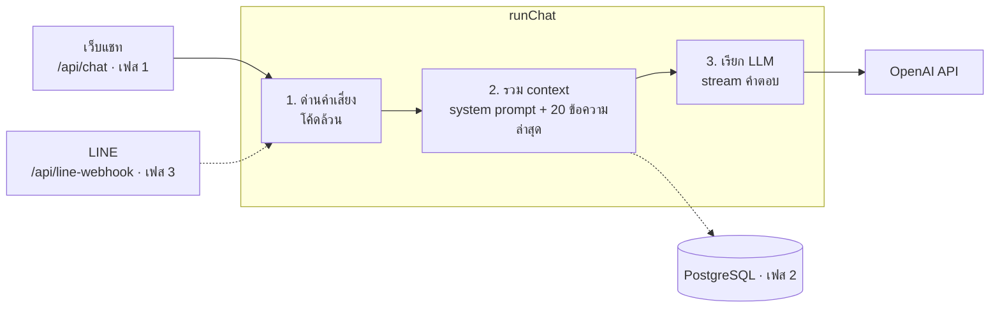

# Architecture

ทุกช่องทางส่งข้อความเข้า `runChat` (`lib/chat-pipeline.ts`) ตัวเดียว ด่านคำเสี่ยงทำงานก่อนเสมอ แล้วจึงรวม context และเรียก LLM

## Request flow (เฟส 1)

1. `proxy.ts` ตรวจ cookie ก่อนทุก request ไม่มี → หน้าเว็บไป `/login`, API ตอบ 401
2. `/api/chat` ตรวจ cookie ซ้ำ → rate limit 20 ครั้ง / 5 นาที → ตรวจรูปแบบข้อมูลด้วย zod (รับเฉพาะ role user/assistant และ part ข้อความ)
3. `runChat` ตรวจคำเสี่ยงจากข้อความล่าสุด → ตัดประวัติเหลือ 20 ข้อความ → เรียก LLM พร้อม system prompt (เพิ่มคำแนะนำพิเศษเมื่อเจอคำเสี่ยง)
4. ตอบกลับเป็น stream พร้อม metadata `{ crisis }` หน้าเว็บใช้ค่านี้แสดงการ์ดสายด่วน 1323
5. Server log เก็บเฉพาะ metadata (token, crisis, เวอร์ชัน prompt) ไม่เก็บเนื้อหาแชท

## ไฟล์สำคัญ

| ไฟล์ | หน้าที่ |
| --- | --- |
| `lib/chat-pipeline.ts` | `runChat` ใช้ร่วมทุกช่องทาง |
| `lib/safety.ts` | ด่านคำเสี่ยงและข้อความสายด่วน |
| `lib/prompt.ts` + `prompts/system-v1.md` | system prompt แบบมีเวอร์ชัน |
| `lib/auth.ts` | session cookie แบบ HMAC สำหรับผู้ใช้คนเดียว |
| `lib/config.ts` | ชื่อบอทและขีดจำกัดทั้งหมด |
| `proxy.ts` | กันทุกหน้าด้วยรหัสผ่าน |
