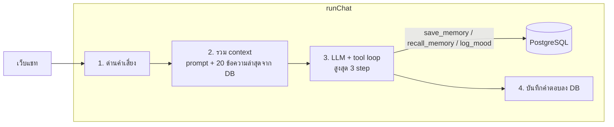

# แผนเฟส 2: ความจำและ tools

> สถานะ: **โค้ดครบ รอทดสอบกับ LLM และ DB จริง** ผู้พัฒนาเลือกให้ Claude เขียนโค้ด และเลือกเก็บแชทพร้อมปุ่มลบ (D3) ข้อ D1, D2, D4, D5 ใช้ตามที่แนะนำ

เป้าหมาย: น้องฟังจำเรื่องสำคัญข้ามแชทได้ และตัดสินใจเองว่าจะจดหรือดึงความจำเมื่อไหร่ ผ่าน tools 3 ตัว (`save_memory`, `recall_memory`, `log_mood`) ตรงนี้คือจุดที่โปรเจคเปลี่ยนจาก chatbot เป็น AI agent

ผ่านเมื่อ: เคสข้อ 11–12 ใน [`tests/conversations.md`](../tests/conversations.md) ผ่าน และเคสข้อ 1–10 ยังผ่านเหมือนเดิม

## ภาพรวม



สิ่งที่เปลี่ยนจากเฟส 1:

1. **ประวัติแชทย้ายไปอยู่ฝั่ง server** หน้าเว็บส่งแค่ข้อความล่าสุดกับ `chatId` server โหลดประวัติจาก DB เอง ข้อดีคือ client ปลอมประวัติไม่ได้ และเปิดเครื่องอื่นก็เห็นแชทเดิม
2. **`runChat` มี tools** ใช้ `tool()` กับ `stopWhen: stepCountIs(3)` ของ AI SDK ไม่ใช้ agent framework (ตาม decision log 2026-10-07)
3. **System prompt v2** เพิ่มส่วนอธิบายว่าเมื่อไหร่ควรใช้ tool แต่ละตัว แล้วรันชุดทดสอบเทียบกับ v1

## Schema

```sql
create table chats (
  id          uuid primary key default gen_random_uuid(),
  user_id     text not null,            -- เฟส 2 ยังเป็น "owner" คนเดียว
  channel     text not null,            -- 'web' | 'line'
  created_at  timestamptz not null default now()
);

create table messages (
  id          text primary key,         -- id จาก AI SDK
  chat_id     uuid not null references chats(id) on delete cascade,
  role        text not null check (role in ('user', 'assistant')),
  parts       jsonb not null,           -- UIMessage parts เก็บทั้งก้อน รองรับ tool part
  created_at  timestamptz not null default now()
);
create index on messages (chat_id, created_at);

create table memories (
  id          uuid primary key default gen_random_uuid(),
  user_id     text not null,
  kind        text not null check (kind in ('goal', 'fact', 'preference', 'person')),
  content     text not null,            -- สรุปสั้นๆ ไม่เกิน 200 ตัวอักษร
  created_at  timestamptz not null default now(),
  deleted_at  timestamptz               -- ลบแบบ soft ผู้ใช้สั่งให้ลืมได้
);

create table mood_logs (
  id          uuid primary key default gen_random_uuid(),
  user_id     text not null,
  score       smallint not null check (score between 1 and 5),
  label       text not null,            -- เช่น 'เหนื่อย', 'โล่ง'
  created_at  timestamptz not null default now()
);
```

## Tools

| Tool | Input (zod) | ทำอะไร | ข้อจำกัด |
| --- | --- | --- | --- |
| `save_memory` | `{ kind, content }` | เพิ่มแถวใน `memories` | content ≤ 200 ตัวอักษร, ไม่บันทึกเมื่อข้อความนั้นติดด่านคำเสี่ยง (ดูข้อ D4) |
| `recall_memory` | `{ kind?: ... }` | คืนความจำล่าสุด 20 รายการ (กรองตาม kind ได้) | ยังไม่ทำ vector search 20 รายการพอสำหรับคนเดียว |
| `log_mood` | `{ score: 1–5, label }` | เพิ่มแถวใน `mood_logs` | บันทึกได้ไม่เกิน 1 ครั้งต่อข้อความ กันบอทจดซ้ำ |

`execute` ของแต่ละ tool รับ `userId` ผ่าน closure ใน `runChat` ไม่รับจาก LLM เพื่อไม่ให้ LLM เขียนข้อมูลของคนอื่นได้

## ขั้นตอน (แต่ละขั้นเป็น PR หนึ่งอัน)

| # | งาน | ไฟล์หลัก | ทดสอบ |
| --- | --- | --- | --- |
| 2.1 ✅ | ต่อ DB, ไฟล์ migration, `lib/db.ts` | `db/migrations/001_init.sql`, `lib/db.ts` | สคริปต์ migrate รันบน DB จริงได้ |
| 2.2 ✅ | เก็บและโหลดประวัติแชทจาก DB, หน้าเว็บส่งแค่ข้อความล่าสุด | `app/api/chat/route.ts`, `lib/chat-store.ts`, `components/chat.tsx` | unit test `chat-store` ด้วย DB ปลอม, รีเฟรชหน้าแล้วแชทยังอยู่ |
| 2.3 ✅ | tools 3 ตัว + tool loop ใน `runChat` | `lib/tools.ts`, `lib/chat-pipeline.ts` | unit test `execute` ของแต่ละ tool |
| 2.4 ✅ (ยังไม่ได้รันชุดทดสอบกับ LLM จริง) | System prompt v2 อธิบายการใช้ tools | `prompts/system-v2.md`, `lib/prompt.ts` | ชุดทดสอบข้อ 1–12 บันทึกผลเทียบ v1 |
| 2.5 ✅ | อัปเดตเอกสาร (README, ARCHITECTURE, decisions) | `docs/*`, `README.md` | — |

## เรื่องที่ต้องตัดสินใจ

| # | คำถาม | ทางเลือก | Claude แนะนำ |
| --- | --- | --- | --- |
| D1 | ใช้ PostgreSQL ที่ไหน | Neon (ผ่าน Vercel Marketplace) / Supabase / Vercel Postgres | **Neon** มี free tier ต่อกับ Vercel ได้ในคลิกเดียว และใช้ driver แบบ HTTP ที่เหมาะกับ serverless |
| D2 | เขียน query ยังไง | SQL ตรงๆ ด้วย `@neondatabase/serverless` / Drizzle ORM | **SQL ตรงๆ** มีแค่ 4 ตาราง เห็น query ชัดและเข้าใจง่ายกว่า |
| D3 | เก็บเนื้อหาแชทใน DB ได้ไหม (เฟส 1 ตั้งใจไม่เก็บใน log) | เก็บทั้งหมด / เก็บแค่ความจำกับ mood ไม่เก็บแชท | **เก็บทั้งหมด** แต่ใน DB ของเราเองที่ต้องมีรหัสผ่าน และมีปุ่มลบแชท ไม่งั้นรีเฟรชแล้วแชทหาย |
| D4 | ข้อความที่ติดด่านคำเสี่ยง ให้บอทจำได้ไหม | ห้ามจด / จดได้ตามปกติ | **ห้ามจด** เรื่องหนักแบบนั้นไม่ควรถูกหยิบกลับมาพูดโดยไม่ตั้งใจ |
| D5 | หน้าเว็บมีรายการแชทเก่าไหม | มีปุ่ม "แชทใหม่" อย่างเดียว / มีแถบรายการแชทเก่า | **ปุ่มแชทใหม่อย่างเดียว** ความจำข้ามแชทมาจาก tools อยู่แล้ว รายการแชทเก่ารอเฟสหลัง |
